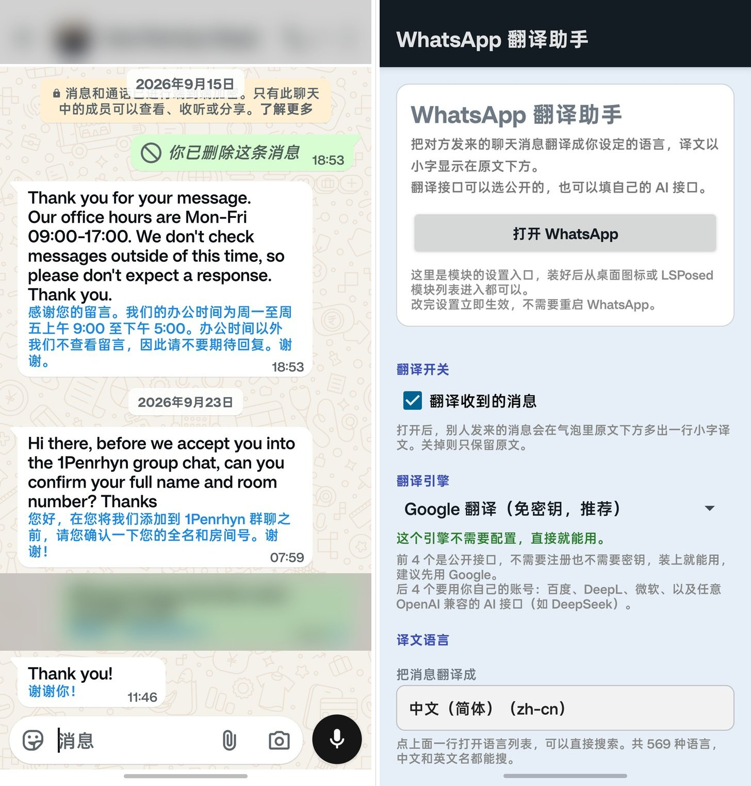

# WhatsApp 翻译助手

面向 WhatsApp 的 Xposed 翻译模块。将聊天消息翻译为设定的语言，译文以小字显示在原文下方，颜色与字号可自定义。

无需注册或登录，不经过任何第三方服务器；翻译由公开接口或调用者自行配置的 AI 接口完成。

> 非官方第三方模块，与 Meta 无关联。第三方组件与数据来源见 [THIRD-PARTY.md](THIRD-PARTY.md)。

---

## 功能

- 将收到的消息翻译为 569 种语言中的任意一种，译文显示在原文下方
- 4 个无需密钥的公开翻译引擎，另有 4 个支持自填账号的引擎
- 支持任意 OpenAI 兼容的 AI 接口，可自定义系统提示词
- 译文颜色、字号、是否斜体可调
- 根据对方号码的国家代码离线查表，得到国家、语言、货币与当地时间
- 设置修改后即时生效，无需重启 WhatsApp

---

## 截图

左侧为翻译效果，右侧为设置界面。



---

## 环境要求

- 已 root 的 Android 9 及以上设备
- LSPosed 或 EdXposed

---

## 安装

1. 从 Releases 下载 `LSTrans.apk` 并安装
2. 打开 LSPosed → **模块** → 启用 **WhatsApp 翻译助手**
3. 进入模块页面 → **作用域** → 勾选 WhatsApp
   - 普通版：`com.whatsapp`
   - Business 版：`com.whatsapp.w4b`
4. 强制停止 WhatsApp 后重新打开
5. 从桌面图标或 LSPosed 模块列表进入设置，选择引擎与目标语言

配置修改后即时生效，无需重启 WhatsApp。

---

## 翻译引擎

切换引擎后，界面会自动展开该引擎所需的配置项。

| 引擎 | 密钥 | 说明 |
|---|---|---|
| Google 翻译 | 否 | `translate-pa.googleapis.com`，默认选项 |
| Google 翻译 · 备用通道 | 否 | `translate_a/single`，主通道异常时使用 |
| Bing 翻译 | 否 | 自动获取会话 token |
| MyMemory 翻译记忆库 | 否 | 公开翻译记忆库 |
| 百度翻译 | 是 | 需 AppID 与密钥，请求需 MD5 签名 |
| DeepL | 是 | 以 `:fx` 结尾的密钥自动使用免费端点 |
| 微软翻译 | 是 | 可选 Region 头 |
| 自定义 AI | 是 | 任意 OpenAI 兼容接口；端点可只填 base，会自动补 `/v1/chat/completions` |

前四个引擎无需任何账号即可使用。

### 自定义 AI 的系统提示词

自定义 AI 引擎会先发送一条系统提示词，再发送待翻译文本。`${toCode}` 会被替换为目标语言代码，默认值见 `Translators.DEFAULT_AI_PROMPT`。

系统提示词是必需的：若完全不发送，部分通用对话模型不会执行翻译，而是把输入当作待处理的普通提问。默认提示词包含三条规则，分别用于抑制多余的说明性前缀、保持段落结构、以及保留不应翻译的专有名词与代码。

需要说明的是，这三条规则的措辞对较新模型的翻译质量影响有限，其价值主要在于对较弱模型、复杂格式文本和容易附加解释的模型提供保障。提示词随每条消息发送，约 110 token，且仅对自定义 AI 引擎生效——其余引擎不是对话式接口，不接受系统提示词。

---

## 语言与对方信息

### 语言

内置 569 种语言，来自 Unicode CLDR，选择器支持按中文名或英文名搜索。

### 对方信息

根据对方号码的国家代码离线查表，得出国家、语言、货币与当地时间。号码不会离开设备。

CLDR 的时区列表按字母序排列，直接取首项会得到并非主要时区的结果，因此 `tools/gen_locale_data.py` 使用显式表指定了 31 个多时区地区与 12 个共享拨号代码的主要项。

---

## 工作原理

### 渲染

实现方式是在 WhatsApp 自身的消息气泡上改写文本，不注入额外视图。

1. Hook `TextView.setText(CharSequence)`
2. 仅处理资源 ID 为 `message_text`、`caption`、`quoted_text` 的 view，因此标题栏、按钮与聊天列表预览不受影响
3. 翻译在线程池中异步执行，完成后回到主线程将文本改写为 `原文 + "\n" + 译文`，仅对译文部分应用 `ForegroundColorSpan`（自定义颜色）与 `RelativeSizeSpan`（自定义字号）
4. 防递归使用 `ThreadLocal` 标记；防 view 复用错乱使用 `setAdditionalInstanceField` 在 view 上保存源文快照，回写前比对
5. 相同文本、引擎与目标语言的组合只请求一次

### 资源 ID 解析

按以下顺序解析：

1. 按名称查询目标应用的资源表
2. R 类反射
3. 内置 ID 兜底（`message_text = 0x7f0b26b8`，取自 WhatsApp 的 `resources.arsc`）

### 收发两个方向

过滤条件是 view 的资源 ID，而非消息方向，因此发出与收到的消息都会显示译文。当目标语言与原文相同时，译文与原文一致，会被跳过而不重复显示。

### 配置的跨进程读取

配置由模块设置页写入，由 WhatsApp 进程读取，通过两条通道：

1. `XSharedPreferences`（manifest 中声明 `xposedsharedprefs=true`）
2. 明文世界可读镜像 `shared_prefs/mirror.xml`

第二条是必需的：在 targetSdk 34 下 `MODE_WORLD_READABLE` 受平台限制，`SharedPreferences` 位于应用私有目录，跨进程无法读取。

---

## 隐私

- 仅申请 `INTERNET` 与 `ACCESS_NETWORK_STATE` 权限
- 仅 hook `com.whatsapp` 与 `com.whatsapp.w4b` 两个包
- 唯一的网络行为由所选引擎决定：使用公开引擎时文本发送至对应服务，使用自填引擎时仅发送至自行配置的端点
- 无账号、无统计上报、无第三方服务器
- 对方信息由国家代码离线查表得出，号码不会离开设备

---

## 构建

无需 Gradle。依赖 JDK 17 或更高版本、Android SDK（含 `build-tools` 与 `platforms/android-34`）以及 Python 3。

```powershell
.\build.ps1              # 构建、签名并安装到已连接设备
.\build.ps1 -SkipInstall # 仅构建
```

构建流程：`javac(stub) → javac(app) → d8 → aapt2 compile/link → repack → zipalign → apksigner`

Xposed API 为 `stubs/` 下的手写声明，编译期存在、运行期由框架的实际实现覆盖，因此不依赖任何外部 Maven 仓库。

签名密钥库按以下顺序查找，均不存在时自动生成一个本地调试用密钥库（已被 `.gitignore` 排除），因此新克隆的仓库可直接构建：

1. 环境变量 `LSTRANS_KEYSTORE`
2. `../watrans.keystore`
3. `./debug.keystore`

发布用的签名密钥库不应提交到仓库。

### 重新生成语言与区号表

```powershell
python tools\fetch_locale_sources.py   # 下载 libphonenumber 元数据
python tools\gen_locale_data.py        # 生成 assets/languages.json 与 regions.json
```

`assets/` 下为生成物，已提交到仓库，常规构建无需网络访问。

---

## 项目结构

```
AndroidManifest.xml          xposed 声明与 LAUNCHER 入口
assets/
  xposed_init                入口类声明
  languages.json             569 种语言（生成物）
  regions.json               206 个地区的区号信息（生成物）
res/mipmap-*/                五档密度图标
src/com/littlesauce/watrans/
  ModuleEntry.java           入口，仅对 com.whatsapp 与 com.whatsapp.w4b 生效
  MessageHook.java           核心：setText 钩子与译文渲染
  Translators.java           8 个引擎的实现
  Engine.java                引擎枚举
  LocaleInfo.java            国家、语言、货币与当地时间
  PickerDialog.java          可搜索选择器（语言与区号）
  Prefs.java                 跨进程配置
  SettingsActivity.java      设置界面，同时是模块入口
  Logger.java                日志
stubs/                       手写 Xposed API 声明
tools/
  fetch_locale_sources.py    下载数据源
  gen_locale_data.py         生成语言与区号表
  make_icon.py               生成图标
  check_secrets.py           提交前扫描密钥
  lsp_enable.py              辅助启用模块
build.ps1, repack.py         构建脚本
```

---

## 常见问题

**译文没有出现**

在 Xposed 日志中搜索 `LSTrans`。日志会记录所用端点、HTTP 状态码与接口返回内容，可据此判断是接口不可用还是配置有误。公开引擎依赖对应服务的可用性，长期可能发生变化。

**聊天列表的预览没有翻译**

这是有意为之。列表预览使用不同的 view ID，翻译它会造成刷屏。

**修改资源 ID 后失效**

WhatsApp 的资源 ID 可能随版本变化。此时需要更新 `MessageHook` 中内置的三个 ID。部分环境下 `XposedHelpers.findClass("android.app.AndroidAppHelper")` 会抛出 `ClassNotFoundException`，因此无法通过名称查询资源表，实际依赖上述内置 ID。

**作用域**

普通版与 Business 版是两个不同的包，需要分别勾选。

---

## 许可

代码采用 [GPL-3.0](LICENSE)。

第三方组件与数据来源的署名见 [THIRD-PARTY.md](THIRD-PARTY.md)：Unicode CLDR（Unicode License）、libphonenumber（Apache-2.0）、Xposed API（Apache-2.0）。
